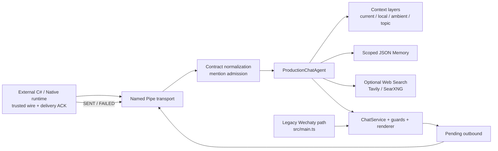
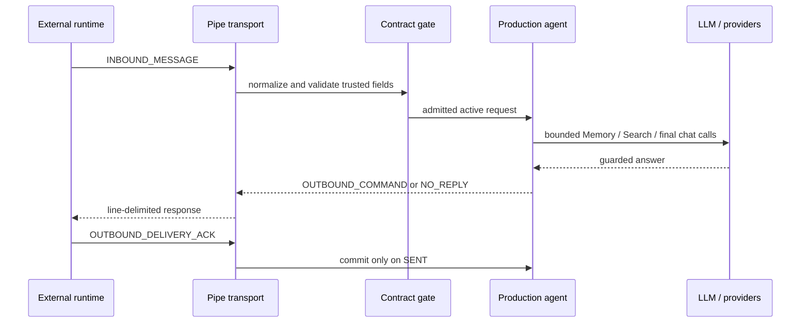

# WeChat-Agent

WeChat-Agent 是一个 TypeScript Agent 层，面向有边界的微信群聊对话。它负责消息契约归一化、提及准入、分层上下文、受控 Memory、可选 Web Search、回答安全护栏以及出站投递确认。

当前仓库只包含 Agent 层。微信桌面客户端、C# runtime、Native Hook/Bridge、Named Pipe 的生产客户端和实际消息发送端均属于外部组件，不在本仓库中。仓库内的测试和构建不等于已经完成真实微信登录、注入或线上发送验证。

## 项目定位

- 稳定代码边界：可信 runtime 字段驱动的消息契约、GROUP 提及准入、请求者本地上下文隔离、Memory 授权与预算、回答护栏、出站 ACK 状态机。
- 可选能力：OpenAI-compatible Chat、Tavily/SearXNG 搜索、网页证据抓取、GROUP topic capsule、owner alias 唤醒和 proactive queue。
- 旧/实验入口：`src/main.ts` 中的 Wechaty/Puppet XP 路径；它保留用于开发验证，不代表生产 runtime 集成。
- 测试入口：production receiver 的 `fake` 模式、测试文件和 synthetic fixtures；它们不会替代真实客户端验收。

## 当前能力

- 外部 runtime 可将未触发 Agent 的群聊消息以 `PASSIVE_CONTEXT_ONLY` 事件发送，用于群聊公共上下文积累；普通 `INBOUND_MESSAGE` 若未通过 mention admission，不会自动转换为 passive context。
- GROUP provider context 按 `currentTurn`、`requesterLocalContext`、`recentGroupAmbient`、`topicContext` 分层组装；不同请求者的本地上下文不互相泄露。
- Persistent Memory 使用单个 JSON 文档，支持 OWNER/MEMBER/GROUP scope、可见性、软删除和原子写入；Memory 不是身份源，也不是授权源。
- Web Search 默认关闭；启用后使用受限 planner、有限查询次数、结果归一化、网页抓取 SSRF 防护和来源 grounding。
- 出站内容必须经过渲染与回答护栏，并由外部 runtime 返回 `SENT`/`FAILED` ACK；只有真实 `SENT` 才会提交 assistant 上下文。
- 日志只记录 token、计数、枚举和错误码等诊断元数据，不记录原始消息、身份值或 provider 原文。

## 架构概览



一次生产主动请求的核心顺序如下：



三条实际路径的区别：

- 普通 `@` 请求：外部 runtime 提供可信 mention admission 后，通过 admission，进入上下文、Memory（符合条件时）、Search（启用时）和最终回答；出站必须等待 ACK。
- passive group context：只有显式的 `PASSIVE_CONTEXT_ONLY` GROUP 事件会追加 `GROUP_AMBIENT` 和同一请求者的 `REQUESTER_LOCAL`，返回 context acceptance；普通未通过 admission 的 `INBOUND_MESSAGE` 不会自动转换为 passive context。
- alias wake / proactive：passive 文本只有命中有限 alias 且满足 cooldown 才会后台生成，放入 proactive queue；外部 runtime 通过 poll 取出后仍需真实发送和 `SENT` ACK。

## 快速开始

### 只验证 Agent 层

要求 Node.js 18+、npm 7+。先安装依赖并运行构建与测试：

```powershell
Copy-Item .env.example .env
npm install
npm run build
npm test
```

这组命令只验证 TypeScript 编译和仓库内的单元/边界测试，不会启动微信客户端、Native Hook、注入流程或真实发送。

### 开发用 Wechaty 入口

`npm run dev` 使用 `src/main.ts`，`npm start` 使用编译后的 `dist/main.js`。该入口需要外部 Wechaty/Puppet XP 运行环境；`BOT_MODE=smoke` 时只回答固定的 `pong`，`BOT_MODE=chat` 时还需要完整的 OpenAI-compatible 配置。它不是本仓库所能独立完成的生产集成。

### 生产 Agent receiver

生产入口由外部 runtime 通过 Windows Named Pipe 驱动：

```powershell
npm run build
npm run start:production-agent -- <pipe-name> real
```

`<pipe-name>` 是外部 runtime 约定的 pipe 名称；`real` 会要求 Chat 配置。`fake` 只用于 receiver/协议测试：

```powershell
npm run start:production-agent -- <pipe-name> fake
```

本仓库不提供 pipe 客户端、可信身份字段的产生方、消息发送方或人工运行时操作说明。生产联调必须由用户人工控制外部微信与 Native runtime，并单独验收登录、收取、发送、ACK 和重启恢复行为。

## 配置

配置项、默认值、敏感性和相互依赖见 [docs/configuration.md](docs/configuration.md)。最小建议是先保持 `BOT_MODE=smoke`、`WEB_SEARCH_ENABLED=0` 和默认本地路径；不要把 `.env`、Memory JSON、日志或运行时导出文件提交到 Git。

## 上下文、Memory 与搜索

- 上下文层和持久 Memory 的差异、生命周期及隔离规则见 [docs/memory-and-context.md](docs/memory-and-context.md)。
- Search 的 planner 协议、provider fallback、网页抓取边界和来源 grounding 见 [docs/web-search.md](docs/web-search.md)。
- Named Pipe wire contract、外部 runtime 职责和已知限制见 [docs/runtime-and-native-integration.md](docs/runtime-and-native-integration.md)。

## 开发与测试

贡献与本地验证方式见 [docs/development.md](docs/development.md) 和 [CONTRIBUTING.md](CONTRIBUTING.md)。安全问题请先阅读 [SECURITY.md](SECURITY.md)。

本项目采用 Apache License 2.0，完整文本见 [LICENSE](LICENSE)。使用者仍需遵守该许可证、第三方依赖许可证以及微信和其他外部服务的适用条款。

`package.json` 保留 `private: true`，因此本轮只处理 GitHub 源码仓库可读性，不宣称支持 npm 发布；如未来要分发 npm 包，应另行完成发布与许可证审查。

## 当前限制与后续方向

- 当前仓库无法证明任何特定微信版本、Native Hook 构建或 C# runtime 发行包的兼容性。
- 生产 Named Pipe 联调、真实群聊发送、外部 runtime ACK 以及重启/升级流程需要仓库外的环境和人工验收。
- Wechaty legacy 路径、主动搜索、topic capsule、owner alias wake 和 proactive outbound 都应视为可选或实验性能力，不能据此宣称生产 SLA。
- 后续可补充外部 runtime 的公开契约样例、兼容矩阵、部署打包与独立的端到端验收证据；这些不应通过放宽当前安全边界来完成。

## 许可证状态

Apache License 2.0，详见 [LICENSE](LICENSE)。
