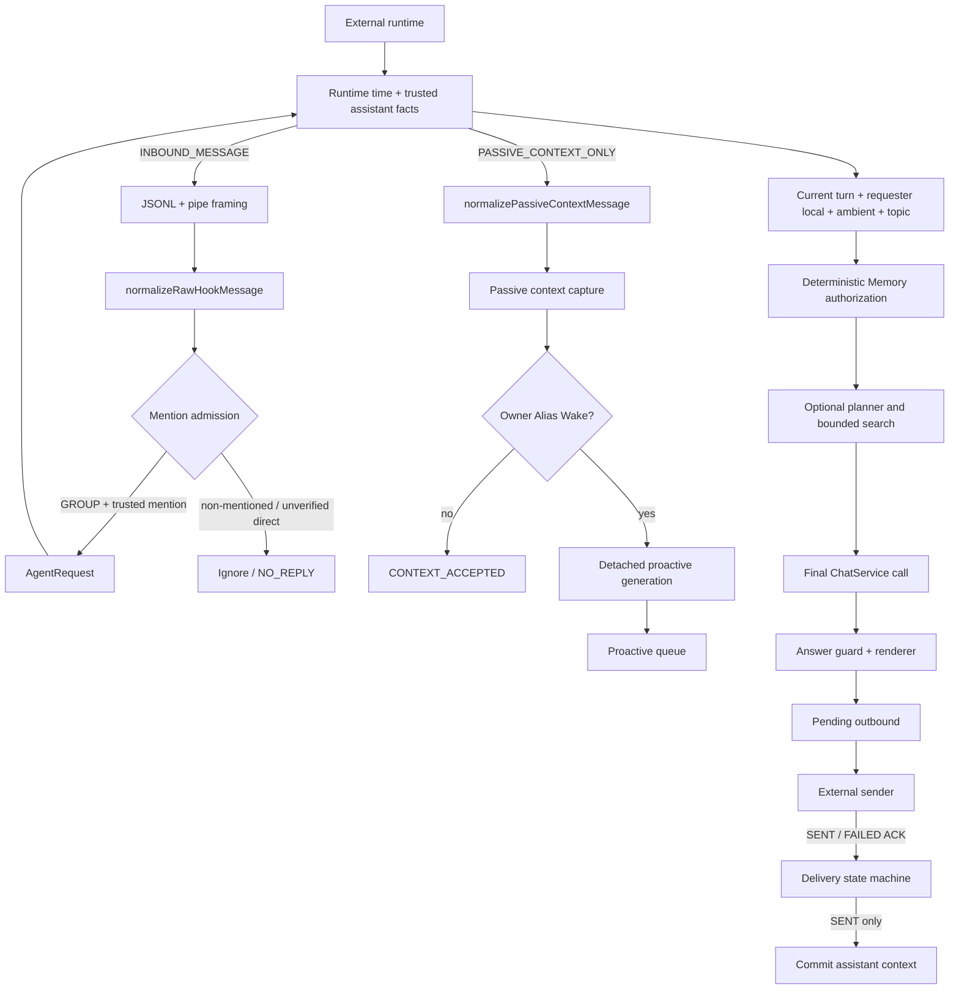
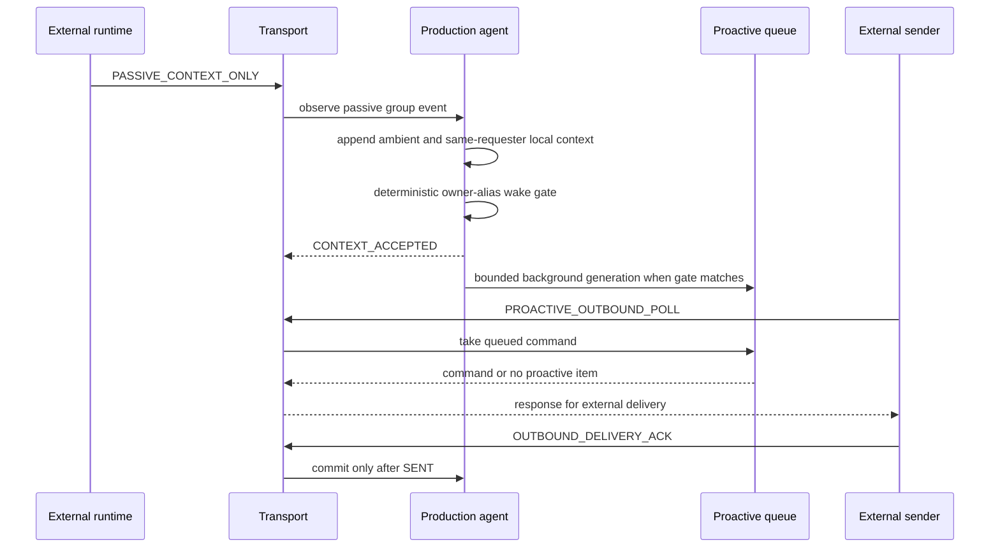

# Architecture

本文档只描述当前仓库能够由源码和测试证明的 Agent 结构。外部 C# runtime、Native Hook、Bridge、微信客户端和实际发送端不是本仓库的模块。

## 边界与模块

| 层 | 主要文件 | 责任 | 明确不负责 |
| --- | --- | --- | --- |
| Legacy Wechaty | `src/main.ts` | 开发用 Wechaty/Puppet XP 收消息、做最小 smoke/chat 回复 | 生产可信身份契约、Native 集成 |
| Wire transport | `src/production-agent-transport.ts` | Windows Named Pipe、JSONL framing、请求/响应类型、ACK 接收 | 产生可信身份、控制客户端生命周期、实际发送 |
| Contract gate | `src/message-contract.ts`, `src/agent-adapter.ts` | 字段归一化、GROUP/DIRECT 分类、mention 与 span 校验、主动/被动分流 | 从昵称、正文或 signature 推断授权 |
| Production agent | `src/production-agent-receiver.ts` | 期限管理、上下文、Memory、搜索、Chat、outbound staging 和 proactive poll | 绕过 runtime 授权、直接投递消息 |
| Context | `src/context.ts`, `src/group-ambient-context.ts`, `src/requester-local-context.ts`, `src/group-conversation-context.ts`, `src/group-topic-capsule.ts` | 进程内短期上下文的边界、预算、TTL 与组装 | 持久化聊天记录、身份或授权证明 |
| Memory | `src/memory-store.ts`, `src/memory-service.ts` | 受限 JSON 持久化、scope/visibility、确定性授权、软删除 | 作为身份源或授权源；被动消息写 Memory |
| Search | `src/web-search-planner.ts`, `src/web-search.ts` | 受限查询、provider fallback、归一化、网页证据与 grounding | 让网页内容改变授权；向模型暴露 URL 列表 |
| Answer and delivery | `src/chat.ts`, `src/answer-guard.ts`, `src/chat-renderer.ts`, `src/outbound-delivery.ts` | 生成回答、敏感内容护栏、渲染、ACK 状态机 | 自动重发、ACK 后再次调用 LLM/Memory/Search |
| Observability | `src/persistent-runtime-log.ts` | token/count/enum/error-code 级别的持久诊断 | 原始正文、身份值和 provider payload |

## 主动请求链路

关键不变量：

1. GROUP 的 `senderId`、`requesterId`、`conversationId` 和 mention admission 事实必须来自受信 runtime contract；mention/user-content spans 用于 canonical framing 与受保护副作用，某些普通 Chat 路径允许 ABSENT span。Agent 不从正文、昵称、`wxid` 或 `signature` 推断 owner 权限。
2. 只有显式 `PASSIVE_CONTEXT_ONLY` 事件走被动上下文路径；未通过 admission 的 `INBOUND_MESSAGE` 不会自动转换为 passive context。
3. `stageOutbound` 只暂存待发送内容；真实发送由外部 runtime 完成，`SENT` ACK 且哈希匹配后才提交 assistant 上下文。
4. ACK 不会重新触发 LLM、Memory 或 Search；重复、未知、过期或哈希不匹配的 ACK 会被拒绝。

## 被动上下文与 proactive 路径

alias wake 是独立的可选行为：它使用有限别名、冷却时间和共享 proactive queue；普通被动消息不会自动进入主动回答链路。被动路径不读写 Persistent Memory，也不调用 provider。

## 稳定、可选、测试与外部依赖

- 稳定的代码/测试边界：契约校验、mention admission、上下文隔离、Memory scope/软删除、搜索结果边界、answer guard、outbound ACK。
- 可选或实验性：Wechaty legacy 入口、Web Search、网页抓取、topic capsule、owner alias wake、proactive outbound。它们的存在不代表已完成线上验收。
- 测试专用：receiver `fake` 模式、各测试文件中的 synthetic identity/path、`summaryPath`、`maxMessages` 和非法 outbound 测试参数。
- 外部依赖：Node/npm、Wechaty/Puppet XP（legacy 入口）、OpenAI-compatible endpoint、Tavily/SearXNG（启用时）、Windows Named Pipe client，以及拥有可信字段并负责发送/ACK 的 C# / Native runtime。

## 运行时数据与日志

Persistent Memory 默认写入 `%LOCALAPPDATA%\WeChatAgent\memory\memory.json`，日志默认写入 `%LOCALAPPDATA%\WeChatAgent\logs`；也可以分别用 `WECHAT_MEMORY_PATH` 与 `WECHAT_LOG_PATH` 指定。它们是本地运行数据，不应进入 Git、release archive 或公开 issue。
